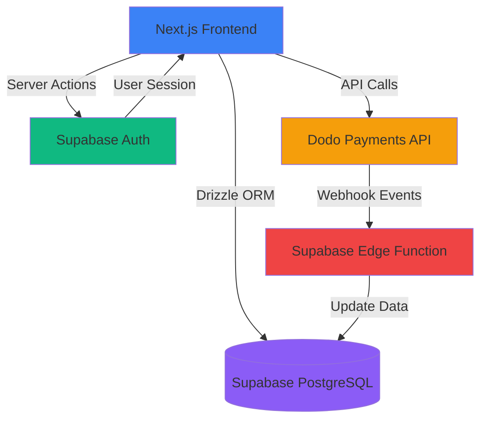
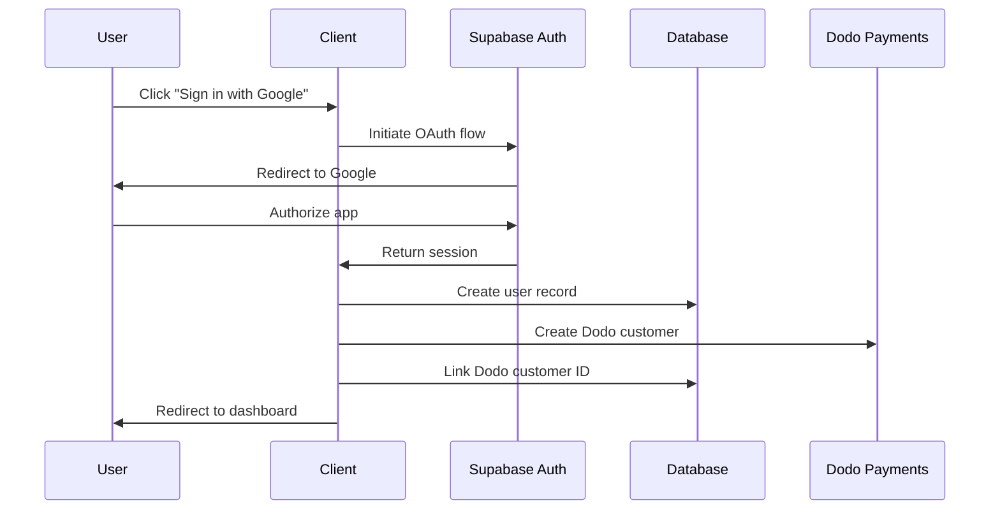
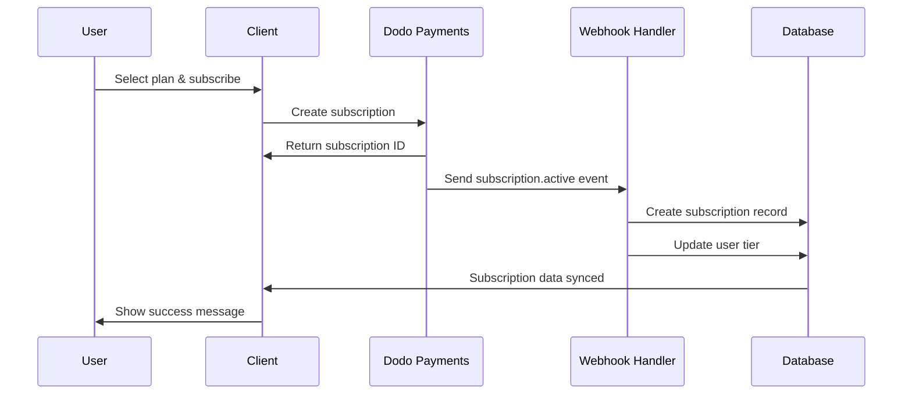
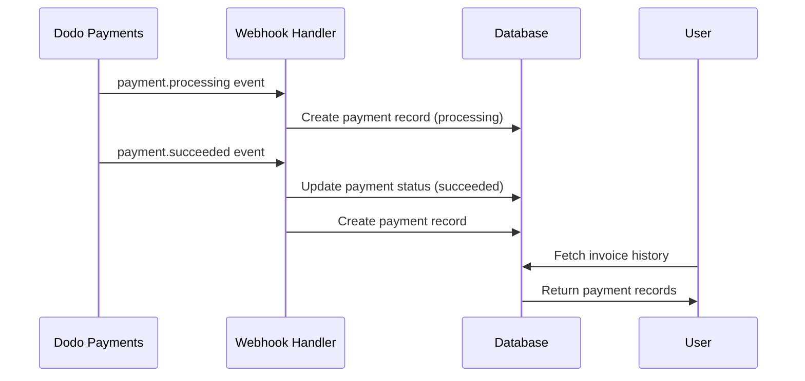

This guide explains how all components work together to create a complete subscription management system.

## Architecture Overview

The application follows a modern serverless architecture with clear separation of concerns:



## Core Components

### Frontend Layer (Next.js 15)

The application uses Next.js 15 with the App Router for optimal performance and developer experience.

<CardGroup cols={2}>
  <Card title="App Router" icon="folder-tree">
    **File-based routing with layouts**
    
    - `/app/page.tsx` - Landing page with auth redirect
    - `/app/login/page.tsx` - Google OAuth sign-in
    - `/app/dashboard/page.tsx` - Subscription management
    - `/app/layout.tsx` - Root layout with theme provider
  </Card>
  
  <Card title="Server Components" icon="server">
    **Default server-side rendering**
    
    ```typescript
    export default async function DashboardPage() {
      const userRes = await getUser();
      const productRes = await getProducts();
      const subscriptionRes = await getUserSubscription();
      
      return <Dashboard {...data} />;
    }
    ```
  </Card>
</CardGroup>

#### Component Structure

```
components/
├── auth/
│   └── google-signin.tsx          # OAuth sign-in button
├── dashboard/
│   ├── dashboard.tsx              # Main dashboard container
│   ├── subscription-management.tsx # Plan details and actions
│   ├── invoice-history.tsx        # Payment records
│   ├── cancel-subscription-dialog.tsx
│   ├── update-plan-dialog.tsx
│   └── restore-subscription-dialog.tsx
├── layout/
│   └── header.tsx                 # Navigation header
├── ui/
│   └── ...                        # shadcn/ui components
└── theme-provider.tsx             # Dark mode support
```

### Authentication Layer (Supabase Auth)

Two-client architecture for secure authentication:

<CodeGroup>
```typescript lib/supabase/client.ts
// Browser client for client-side operations
import { createBrowserClient } from "@supabase/ssr";

export const createClient = () =>
  createBrowserClient(
    process.env.NEXT_PUBLIC_SUPABASE_URL!,
    process.env.NEXT_PUBLIC_SUPABASE_ANON_KEY!
  );
```

```typescript lib/supabase/server.ts
// Server client for server actions and RSC
import { createServerClient } from "@supabase/ssr";
import { cookies } from "next/headers";

export async function createClient() {
  const cookieStore = await cookies();
  
  return createServerClient(
    process.env.NEXT_PUBLIC_SUPABASE_URL!,
    process.env.NEXT_PUBLIC_SUPABASE_ANON_KEY!,
    {
      cookies: {
        getAll() {
          return cookieStore.getAll();
        },
        setAll(cookiesToSet) {
          cookiesToSet.forEach(({ name, value, options }) => {
            cookieStore.set(name, value, options);
          });
        },
      },
    }
  );
}
```

```typescript lib/supabase/admin.ts
// Admin client for privileged operations
import { createClient } from "@supabase/supabase-js";

export const supabaseAdmin = createClient(
  process.env.NEXT_PUBLIC_SUPABASE_URL!,
  process.env.SUPABASE_SERVICE_ROLE_KEY!
);
```
</CodeGroup>

<Warning>
  The service role key has admin privileges and should **never** be exposed to the client. Only use it in server-side code.
</Warning>

### Database Layer (PostgreSQL + Drizzle)

PostgreSQL database hosted on Supabase with type-safe ORM access:

#### Schema Relationships

```typescript
// User → Subscription relationship (one-to-many)
export const usersRelations = relations(users, ({ one, many }) => ({
  currentSubscription: one(subscriptions, {
    fields: [users.currentSubscriptionId],
    references: [subscriptions.subscriptionId],
  }),
  subscriptions: many(subscriptions),
}));

// Subscription → User relationship (many-to-one)
export const subscriptionsRelations = relations(subscriptions, ({ one }) => ({
  user: one(users, {
    fields: [subscriptions.userId],
    references: [users.supabaseUserId],
  }),
}));
```

#### Data Flow

1. **User signs up** → Supabase Auth creates user → Server action creates user record
2. **User subscribes** → Dodo Payments creates subscription → Webhook updates database
3. **Payment succeeds** → Webhook creates payment record → User tier updated
4. **User cancels** → API call to Dodo → Webhook marks subscription as cancelled

### Payment Layer (Dodo Payments)

Integration with Dodo Payments for subscription billing:

```typescript
// lib/dodo-payments/client.ts
import DodoPayments from "dodopayments";

export const dodoClient = new DodoPayments({
  bearerToken: process.env.DODO_PAYMENTS_API_KEY!,
  environment: process.env.DODO_PAYMENTS_ENVIRONMENT!
});
```

#### Key Operations

<Tabs>
  <Tab title="Create Subscription">
    ```typescript
    // actions/change-plan.ts
    const customer = await dodoClient.customers.create({
      email: user.email!,
      name: user.user_metadata.full_name,
    });

    await dodoClient.miscellaneous.createSubscription({
      customer_id: customer.customer_id,
      product_id: productId,
    });
    ```
  </Tab>
  
  <Tab title="Change Plan">
    ```typescript
    // actions/change-plan.ts
    await dodoClient.miscellaneous.changeSubscriptionPlan({
      subscription_id: currentSubscription.subscriptionId,
      product_id: newProductId,
    });
    ```
  </Tab>
  
  <Tab title="Cancel Subscription">
    ```typescript
    // actions/cancel-subscription.ts
    await dodoClient.subscriptions.update(subscriptionId, {
      cancel_at_next_billing_date: true,
    });
    ```
  </Tab>
  
  <Tab title="Fetch Products">
    ```typescript
    // actions/get-products.ts
    const products = await dodoClient.products.list();
    return { success: true, data: products.items };
    ```
  </Tab>
</Tabs>

### Webhook Handler (Supabase Edge Function)

Deno-based serverless function deployed to Supabase:

```typescript
// supabase/functions/dodo-webhook/index.ts
Deno.serve(async (req) => {
  // Verify webhook signature
  const webhook = new Webhook(dodoWebhookSecret);
  await webhook.verify(rawBody, webhookHeaders);
  
  // Route events to handlers
  switch (event.type) {
    case "payment.succeeded":
      await managePayment(event);
      break;
    case "subscription.active":
      await manageSubscription(event);
      await updateUserTier(event.data);
      break;
    case "subscription.cancelled":
      await manageSubscription(event);
      await downgradeToHobbyPlan(event.data);
      break;
  }
});
```

#### Webhook Functions

<Accordion title="managePayment">
  Upserts payment records to the `payments` table:
  
  ```typescript
  async function managePayment(event: any) {
    const data = {
      payment_id: event.data.payment_id,
      status: event.data.status,
      total_amount: event.data.total_amount,
      currency: event.data.currency,
      customer_email: event.data.customer.email,
      webhook_data: event,
      // ... more fields
    };
    
    await supabase.from("payments").upsert(data, {
      onConflict: "payment_id",
    });
  }
  ```
</Accordion>

<Accordion title="manageSubscription">
  Upserts subscription records to the `subscriptions` table:
  
  ```typescript
  async function manageSubscription(event: any) {
    const data = {
      subscription_id: event.data.subscription_id,
      status: event.data.status,
      product_id: event.data.product_id,
      next_billing_date: event.data.next_billing_date,
      // ... more fields
    };
    
    await supabase.from("subscriptions").upsert(data, {
      onConflict: "subscription_id",
    });
  }
  ```
</Accordion>

<Accordion title="updateUserTier">
  Links active subscription to user:
  
  ```typescript
  async function updateUserTier(props) {
    await supabase
      .from("users")
      .update({ current_subscription_id: props.subscriptionId })
      .eq("dodo_customer_id", props.dodoCustomerId);
  }
  ```
</Accordion>

<Accordion title="downgradeToHobbyPlan">
  Removes subscription reference from user:
  
  ```typescript
  async function downgradeToHobbyPlan(props) {
    await supabase
      .from("users")
      .update({ current_subscription_id: null })
      .eq("dodo_customer_id", props.dodoCustomerId);
  }
  ```
</Accordion>

## Data Flow Diagrams

### User Registration Flow



### Subscription Creation Flow



### Payment Processing Flow



## Server Actions

All data mutations go through Next.js server actions for security:

```typescript
// actions/ directory structure
actions/
├── get-user.ts                    # Fetch authenticated user
├── get-products.ts                # List available plans
├── get-user-subscription.ts       # Get current subscription
├── get-invoices.ts                # Fetch payment history
├── create-user.ts                 # Initialize user record
├── create-dodo-customer.ts        # Register with Dodo
├── change-plan.ts                 # Upgrade/downgrade
├── cancel-subscription.ts         # Cancel at next billing
├── restore-subscription.ts        # Undo cancellation
└── delete-account.ts              # Remove user data
```

### Type-Safe Action Pattern

```typescript
"use server";

import { ServerActionRes } from "@/types/server-action";

export async function getUser(): ServerActionRes<User> {
  try {
    const supabase = await createClient();
    const { data: { user } } = await supabase.auth.getUser();
    
    if (!user) {
      return { success: false, error: "User not found" };
    }
    
    return { success: true, data: user };
  } catch (error) {
    return { success: false, error: "Failed to get user" };
  }
}
```

<Note>
  All server actions return a standardized response type with `success` boolean and either `data` or `error` fields.
</Note>

## Security Considerations

### Environment Variables

<CardGroup cols={2}>
  <Card title="Public Variables" icon="globe">
    Safe to expose to client (prefixed with `NEXT_PUBLIC_`):
    - `NEXT_PUBLIC_SUPABASE_URL`
    - `NEXT_PUBLIC_SUPABASE_ANON_KEY`
  </Card>
  
  <Card title="Secret Variables" icon="lock">
    Server-side only (never expose to client):
    - `SUPABASE_SERVICE_ROLE_KEY`
    - `DODO_PAYMENTS_API_KEY`
    - `DODO_WEBHOOK_SECRET`
    - `DATABASE_URL`
  </Card>
</CardGroup>

### Webhook Security

```typescript
// Verify webhook signature before processing
const webhook = new Webhook(dodoWebhookSecret);

try {
  await webhook.verify(rawBody, webhookHeaders);
} catch (error) {
  return new Response("Invalid webhook signature", { status: 400 });
}
```

### Row Level Security (RLS)

<Warning>
  This starter kit uses service role keys in server actions, which bypass RLS. For production applications, implement proper RLS policies on your Supabase tables.
</Warning>

## Deployment Architecture

### Recommended Hosting

<Tabs>
  <Tab title="Vercel (Frontend)">
    Deploy Next.js application to Vercel:
    
    1. Connect GitHub repository
    2. Configure environment variables
    3. Deploy with automatic CI/CD
    
    **Benefits:**
    - Zero-config deployment
    - Edge network distribution
    - Automatic HTTPS
    - Preview deployments
  </Tab>
  
  <Tab title="Supabase (Backend)">
    Backend services hosted on Supabase:
    
    - PostgreSQL database
    - Authentication service
    - Edge Functions for webhooks
    - File storage (if needed)
    
    **Benefits:**
    - Managed PostgreSQL
    - Built-in auth
    - Serverless functions
    - Real-time subscriptions
  </Tab>
  
  <Tab title="Dodo Payments (Billing)">
    Payment processing through Dodo:
    
    - Subscription management
    - Payment processing
    - Invoice generation
    - Webhook events
    
    **Benefits:**
    - Compliance handling
    - Multi-currency support
    - Tax calculations
    - Global payment methods
  </Tab>
</Tabs>

### Production Checklist

<Steps>
  <Step title="Environment Setup">
    Switch from `test_mode` to `live_mode` in Dodo Payments configuration
  </Step>
  
  <Step title="Database Migration">
    Run `bun run db:push` to apply schema to production database
  </Step>
  
  <Step title="Webhook Deployment">
    Deploy webhook function with production credentials:
    ```bash
    bun run deploy:webhook --project-ref YOUR_PROD_PROJECT
    ```
  </Step>
  
  <Step title="Configure Webhooks">
    Update webhook URL in Dodo Payments dashboard to production endpoint
  </Step>
  
  <Step title="Test Payment Flow">
    Make a test subscription to verify end-to-end flow
  </Step>
</Steps>

## Performance Optimizations

### Next.js Features

- **Turbopack**: Fast development builds
- **React Server Components**: Reduced client JavaScript
- **Server Actions**: Eliminates API route overhead
- **Automatic Code Splitting**: Optimized bundle sizes

### Database Optimizations

```typescript
// Indexed columns for fast lookups
supabaseUserId: text("supabase_user_id").primaryKey()
dodoCustomerId: text("dodo_customer_id").notNull()
subscriptionId: text("subscription_id").primaryKey()
```

### Caching Strategy

<Note>
  Consider implementing React Server Component caching for product lists and subscription data to reduce database queries.
</Note>

## Extending the Architecture

### Adding New Features

<CardGroup cols={2}>
  <Card title="Email Notifications" icon="envelope">
    Add transactional emails using Resend or SendGrid triggered by webhook events
  </Card>
  
  <Card title="Usage Tracking" icon="chart-line">
    Implement metered billing by tracking usage and syncing with Dodo Payments
  </Card>
  
  <Card title="Team Management" icon="users">
    Extend schema to support team subscriptions with multiple users
  </Card>
  
  <Card title="Admin Dashboard" icon="gauge">
    Build admin panel using Supabase service role to manage users and subscriptions
  </Card>
</CardGroup>

### Integration Points

The architecture is designed for extensibility:

- **Webhook handler**: Add new event types in the switch statement
- **Server actions**: Create new actions for additional business logic
- **Database schema**: Extend with migrations using Drizzle Kit
- **UI components**: Add new pages using the established patterns
