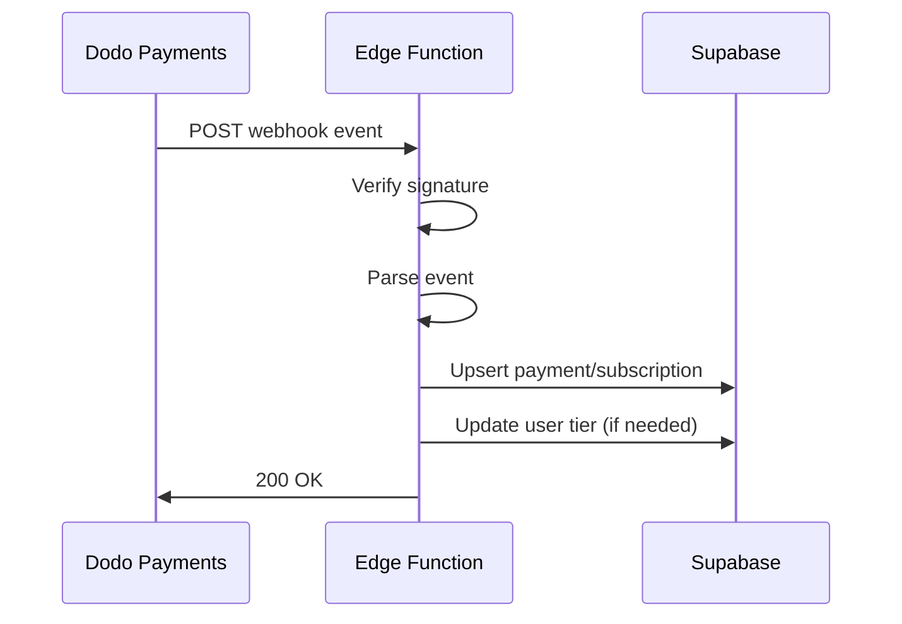

## Overview

The webhook handler is implemented as a Supabase Edge Function that processes payment and subscription events from Dodo Payments. It validates webhook signatures, processes events, and syncs data to the database.

## Location

```
supabase/functions/dodo-webhook/index.ts
```

## Webhook Handler

### Setup and Configuration

```typescript
import { createClient } from "https://esm.sh/@supabase/supabase-js@2.56.0";
import { Webhook } from "https://esm.sh/standardwebhooks@1.0.0";

const corsHeaders = {
  "Access-Control-Allow-Origin": "*",
  "Access-Control-Allow-Headers": "authorization, x-client-info, apikey, content-type",
};

// Initialize Supabase client with service role key
const supabase = createClient(
  Deno.env.get("SUPABASE_URL")!,
  Deno.env.get("SUPABASE_SERVICE_ROLE_KEY")!
);
```

### Main Handler

```typescript
Deno.serve(async (req) => {
  // Handle CORS preflight
  if (req.method === "OPTIONS") {
    return new Response("ok", { headers: corsHeaders });
  }

  // Only accept POST requests
  if (req.method !== "POST") {
    return new Response("Method Not Allowed", {
      status: 405,
      headers: corsHeaders,
    });
  }

  // Get webhook secret from environment
  const dodoWebhookSecret = Deno.env.get("DODO_WEBHOOK_SECRET");
  if (!dodoWebhookSecret) {
    console.error("DODO_WEBHOOK_SECRET is not set.");
    return new Response("Server configuration error", {
      status: 500,
      headers: corsHeaders,
    });
  }

  // Verify webhook signature
  const webhook = new Webhook(dodoWebhookSecret);
  const rawBody = await req.text();
  const event = JSON.parse(rawBody);

  const webhookHeaders = {
    "webhook-id": req.headers.get("webhook-id") || "",
    "webhook-signature": req.headers.get("webhook-signature") || "",
    "webhook-timestamp": req.headers.get("webhook-timestamp") || "",
  };

  console.info(`Received ${event.type} event`);

  try {
    await webhook.verify(rawBody, webhookHeaders);
  } catch (error) {
    console.error("Webhook verification failed:", error.message);
    return new Response("Invalid webhook signature", {
      status: 400,
      headers: corsHeaders,
    });
  }

  // Process event
  try {
    await processEvent(event);
    return new Response(JSON.stringify({ success: true }), {
      status: 200,
      headers: { ...corsHeaders, "Content-Type": "application/json" },
    });
  } catch (error) {
    console.error("Error processing webhook:", error.message);
    return new Response("Error processing webhook", {
      status: 500,
      headers: corsHeaders,
    });
  }
});
```

## Event Processing

### Event Router

```typescript
switch (event.type) {
  // Payment events
  case "payment.succeeded":
  case "payment.failed":
  case "payment.processing":
  case "payment.cancelled":
    await managePayment(event);
    break;

  // Subscription activation/changes
  case "subscription.active":
  case "subscription.plan_changed":
    await manageSubscription(event);
    await updateUserTier({
      dodoCustomerId: event.data.customer.customer_id,
      subscriptionId: event.data.subscription_id,
    });
    break;

  // Subscription status updates
  case "subscription.renewed":
  case "subscription.on_hold":
    await manageSubscription(event);
    break;

  // Subscription termination
  case "subscription.cancelled":
  case "subscription.expired":
  case "subscription.failed":
    await manageSubscription(event);
    await downgradeToHobbyPlan({
      dodoCustomerId: event.data.customer.customer_id,
    });
    break;

  default:
    console.warn(`Unhandled event type: ${event.type}`);
    return new Response("Unhandled event type", {
      status: 200,
      headers: corsHeaders,
    });
}
```

## Payment Management

### managePayment Function

Inserts or updates payment records in the database.

```typescript
async function managePayment(event: any) {
  const data = {
    payment_id: event.data.payment_id,
    brand_id: event.data.brand_id,
    created_at: event.data.created_at,
    currency: event.data.currency,
    metadata: event.data.metadata,
    payment_method: event.data.payment_method,
    payment_method_type: event.data.payment_method_type,
    status: event.data.status,
    subscription_id: event.data.subscription_id,
    total_amount: event.data.total_amount,
    customer_email: event.data.customer.email,
    customer_name: event.data.customer.name,
    customer_id: event.data.customer.customer_id,
    webhook_data: event, // Store complete webhook payload
    billing: event.data.billing,
    business_id: event.data.business_id,
    card_issuing_country: event.data.card_issuing_country,
    card_last_four: event.data.card_last_four,
    card_network: event.data.card_network,
    card_type: event.data.card_type,
    discount_id: event.data.discount_id,
    disputes: event.data.disputes,
    error_code: event.data.error_code,
    error_message: event.data.error_message,
    payment_link: event.data.payment_link,
    product_cart: event.data.product_cart,
    refunds: event.data.refunds,
    settlement_amount: event.data.settlement_amount,
    settlement_currency: event.data.settlement_currency,
    settlement_tax: event.data.settlement_tax,
    tax: event.data.tax,
    updated_at: event.data.updated_at,
  };

  const { error } = await supabase.from("payments").upsert(data, {
    onConflict: "payment_id",
  });

  if (error) throw error;
  console.log(`Payment ${data.payment_id} upserted successfully.`);
}
```

**Features:**
- Upserts payment records (insert or update)
- Stores complete webhook data for audit trail
- Handles all payment statuses (succeeded, failed, processing, cancelled)

## Subscription Management

### manageSubscription Function

Syncs subscription data from webhooks to database.

```typescript
async function manageSubscription(event: any) {
  const data = {
    subscription_id: event.data.subscription_id,
    addons: event.data.addons,
    billing: event.data.billing,
    cancel_at_next_billing_date: event.data.cancel_at_next_billing_date,
    cancelled_at: event.data.cancelled_at,
    created_at: event.data.created_at,
    currency: event.data.currency,
    customer_email: event.data.customer.email,
    customer_name: event.data.customer.name,
    customer_id: event.data.customer.customer_id,
    discount_id: event.data.discount_id,
    metadata: event.data.metadata,
    next_billing_date: event.data.next_billing_date,
    on_demand: event.data.on_demand,
    payment_frequency_count: event.data.payment_frequency_count,
    payment_period_interval: event.data.payment_frequency_interval,
    previous_billing_date: event.data.previous_billing_date,
    product_id: event.data.product_id,
    quantity: event.data.quantity,
    recurring_pre_tax_amount: event.data.recurring_pre_tax_amount,
    status: event.data.status,
    subscription_period_count: event.data.subscription_period_count,
    subscription_period_interval: event.data.subscription_period_interval,
    tax_inclusive: event.data.tax_inclusive,
    trial_period_days: event.data.trial_period_days,
  };

  const { error } = await supabase.from("subscriptions").upsert(data, {
    onConflict: "subscription_id",
  });

  if (error) throw error;
  console.log(`Subscription ${data.subscription_id} upserted successfully.`);
}
```

**Features:**
- Upserts subscription records
- Captures all subscription metadata
- Updates billing dates and status

## User Tier Management

### updateUserTier Function

Activates paid subscription for user.

```typescript
async function updateUserTier(props: {
  dodoCustomerId: string;
  subscriptionId: string;
}) {
  const { error } = await supabase
    .from("users")
    .update({ current_subscription_id: props.subscriptionId })
    .eq("dodo_customer_id", props.dodoCustomerId);

  if (error) throw error;
  console.log(`User tier updated for customer ${props.dodoCustomerId}.`);
}
```

**Called on:**
- `subscription.active` - New subscription activated
- `subscription.plan_changed` - Plan upgraded/downgraded

### downgradeToHobbyPlan Function

Reverts user to free tier.

```typescript
async function downgradeToHobbyPlan(props: { dodoCustomerId: string }) {
  const { error } = await supabase
    .from("users")
    .update({ current_subscription_id: null })
    .eq("dodo_customer_id", props.dodoCustomerId);

  if (error) throw error;
  console.log(`User downgraded for customer ${props.dodoCustomerId}.`);
}
```

**Called on:**
- `subscription.cancelled` - User cancelled subscription
- `subscription.expired` - Subscription expired
- `subscription.failed` - Payment failed

## Webhook Events

### Payment Events

| Event | Description | Action |
|-------|-------------|--------|
| `payment.succeeded` | Payment completed successfully | Store payment record |
| `payment.failed` | Payment failed | Store payment with error |
| `payment.processing` | Payment being processed | Store payment status |
| `payment.cancelled` | Payment cancelled | Store cancellation |

### Subscription Events

| Event | Description | Actions |
|-------|-------------|--------|
| `subscription.active` | New subscription activated | Store subscription, update user tier |
| `subscription.plan_changed` | Plan upgraded/downgraded | Update subscription, update user tier |
| `subscription.renewed` | Subscription renewed | Update subscription |
| `subscription.on_hold` | Subscription paused | Update subscription status |
| `subscription.cancelled` | Subscription cancelled | Update subscription, downgrade user |
| `subscription.expired` | Subscription expired | Update subscription, downgrade user |
| `subscription.failed` | Subscription payment failed | Update subscription, downgrade user |

## Security

### Signature Verification

All webhooks are verified using the Standard Webhooks library:

```typescript
const webhook = new Webhook(dodoWebhookSecret);
try {
  await webhook.verify(rawBody, webhookHeaders);
} catch (error) {
  // Reject invalid webhooks
  return new Response("Invalid webhook signature", { status: 400 });
}
```

**Headers Required:**
- `webhook-id` - Unique webhook ID
- `webhook-signature` - HMAC signature
- `webhook-timestamp` - Timestamp for replay protection

### Environment Variables

Required environment variables:
- `DODO_WEBHOOK_SECRET` - Webhook signing secret from Dodo Payments
- `SUPABASE_URL` - Supabase project URL
- `SUPABASE_SERVICE_ROLE_KEY` - Service role key for database access

## Error Handling

```typescript
try {
  switch (event.type) {
    case "payment.succeeded":
      await managePayment(event);
      break;
    // ... other cases
  }
} catch (error) {
  console.error("Error processing webhook:", error.message);
  return new Response("Error processing webhook", {
    status: 500,
    headers: corsHeaders,
  });
}
```

**Error Responses:**
- 400 - Invalid signature
- 405 - Method not allowed (non-POST)
- 500 - Server error or missing configuration
- 200 - Success or unhandled event type

## Logging

All webhook events are logged:

```typescript
console.info(`Received ${event.type} event`);
console.log(`Payment ${paymentId} upserted successfully.`);
console.log(`Subscription ${subscriptionId} upserted successfully.`);
console.log(`User tier updated for customer ${customerId}.`);
console.warn(`Unhandled event type: ${event.type}`);
```

## Testing Webhooks

### Local Testing

1. Start Supabase locally:
```bash
supabase start
```

2. Serve the function:
```bash
supabase functions serve dodo-webhook
```

3. Send test webhook:
```bash
curl -X POST http://localhost:54321/functions/v1/dodo-webhook \
  -H "Content-Type: application/json" \
  -H "webhook-id: test-id" \
  -H "webhook-signature: test-signature" \
  -H "webhook-timestamp: $(date +%s)" \
  -d '{"type": "payment.succeeded", "data": {...}}'
```

### Production Deployment

1. Deploy to Supabase:
```bash
supabase functions deploy dodo-webhook
```

2. Set environment variables:
```bash
supabase secrets set DODO_WEBHOOK_SECRET=your_secret
```

3. Configure webhook URL in Dodo Payments dashboard:
```
https://your-project.supabase.co/functions/v1/dodo-webhook
```

## Workflow



## Best Practices

1. **Idempotency** - Use upsert operations to handle duplicate webhooks
2. **Validation** - Always verify webhook signatures
3. **Logging** - Log all events for debugging and audit trails
4. **Error Handling** - Catch and log errors, return appropriate status codes
5. **Atomic Operations** - Use database transactions for multi-step updates
6. **Payload Storage** - Store complete webhook data for troubleshooting